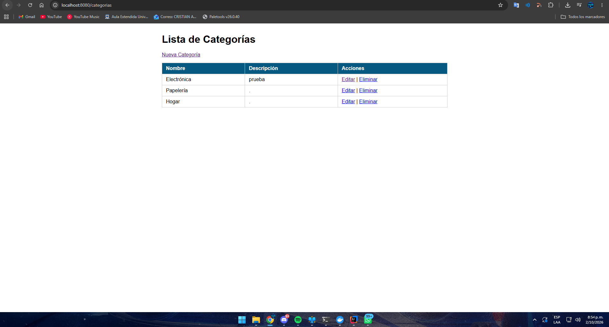
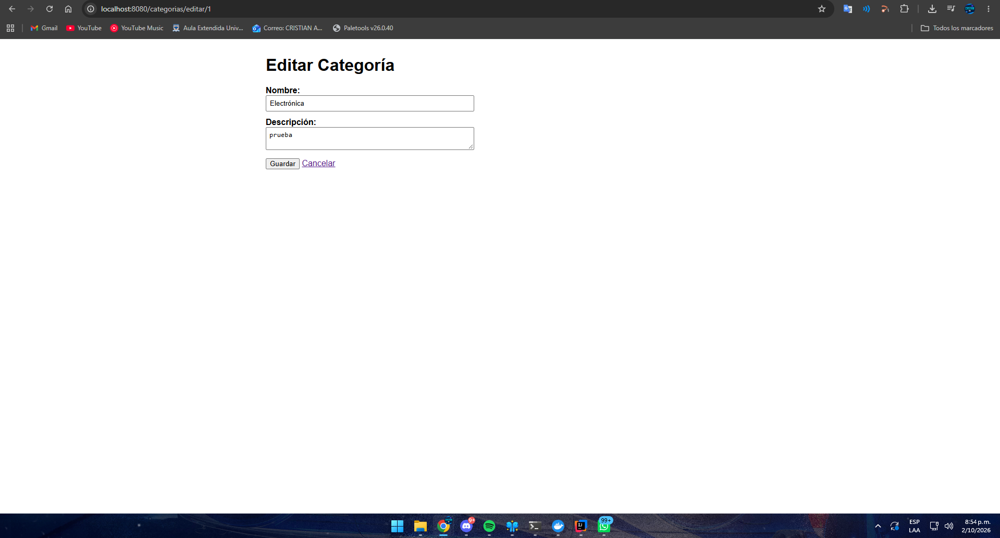
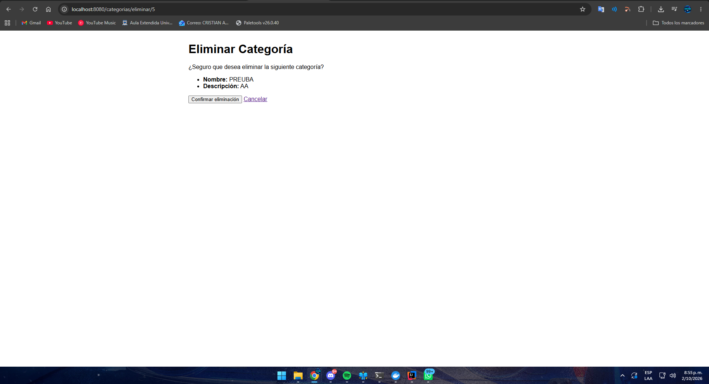
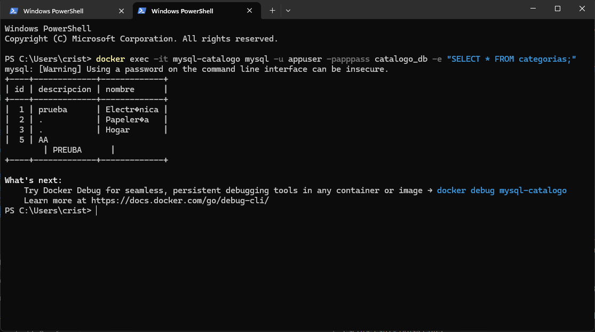
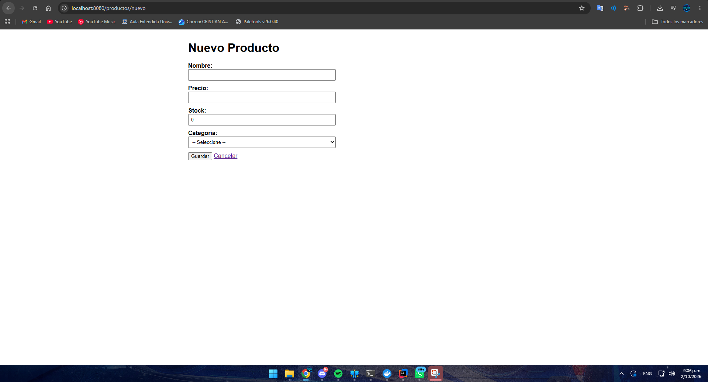
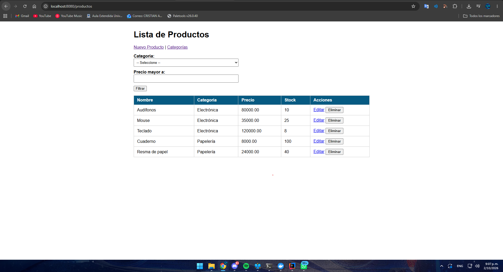
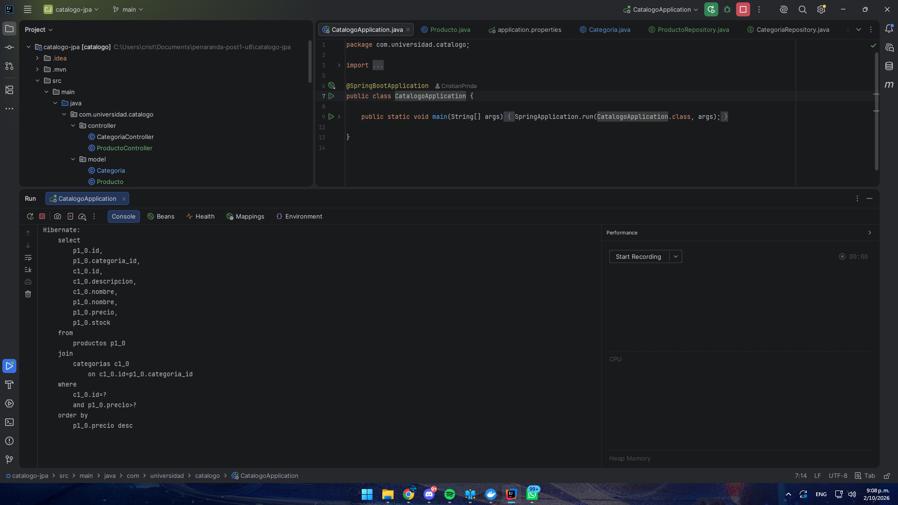
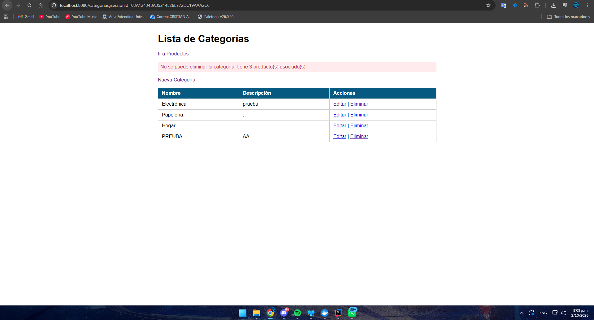
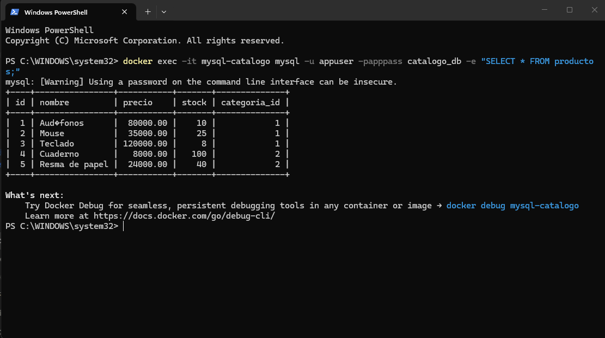

# Post-contenido — Unidad 8: Persistencia con JPA/Hibernate

**Autor:** Cristian Alonso Peñaranda Parra
**Curso:** Programación Web — Universidad de Santander (UDES)

## Descripción
Repositorio del laboratorio de la Unidad 8 de Programación Web.
Contiene un único proyecto Maven Spring Boot (`catalogo-jpa/`) con un
CRUD de categorías usando Spring Data JPA e Hibernate contra MySQL, y su
extensión con la entidad `Producto` y una relación
`@ManyToOne`/`@OneToMany` hacia `Categoria`.

**Tecnologías:** Java 17, Spring Boot 4.1, Spring Web, Spring Data JPA,
Hibernate, MySQL 8, Thymeleaf, Bean Validation, Maven.

## Prerrequisitos
- JDK 17 o superior en el PATH.
- MySQL 8.x en ejecución en el puerto 3306 (o Docker).
- Maven (incluido en el wrapper `mvnw` del proyecto).
- IntelliJ IDEA o VS Code con extensiones Java.
- Git.

## Funcionalidades implementadas
- CRUD completo de categorías: listar, crear, editar y eliminar (con
  pantalla de confirmación).
- Validación con Bean Validation y nombre de categoría único, con
  mensajes junto al campo sin perder los datos del formulario.
- CRUD completo de productos asociados a una categoría.
- Lista de productos con el nombre de su categoría (`JOIN FETCH`).
- Consulta JPQL personalizada: productos de una categoría con precio
  mayor a un valor dado, ordenados de mayor a menor precio.
- Rechazo del borrado de una categoría que tiene productos asociados.

## Modelo de datos
```
+---------------------+          +---------------------------+
| categorias          |          | productos                 |
+---------------------+          +---------------------------+
| id (PK)             | 1      N | id (PK)                   |
| nombre (UNIQUE)     |<---------| nombre                    |
| descripcion         |          | precio                    |
+---------------------+          | stock                     |
                                 | categoria_id (FK, NOT NULL)|
                                 +---------------------------+

Producto  -> @ManyToOne(fetch = LAZY) @JoinColumn(name = "categoria_id")
Categoria -> @OneToMany(mappedBy = "categoria", fetch = LAZY)
```

## Configuración de la base de datos
1. Crear la base de datos y el usuario en MySQL:
```sql
   CREATE DATABASE catalogo_db CHARACTER SET utf8mb4 COLLATE utf8mb4_unicode_ci;
   CREATE USER 'appuser'@'%' IDENTIFIED BY 'apppass';
   GRANT ALL PRIVILEGES ON catalogo_db.* TO 'appuser'@'%';
   FLUSH PRIVILEGES;
```
Con Docker:
`docker run -d --name mysql-catalogo -p 3306:3306 -e MYSQL_ROOT_PASSWORD=root mysql:8`
2. Revisar `catalogo-jpa/src/main/resources/application.properties`
   (URL, usuario `appuser` y contraseña `apppass`, credenciales de
   laboratorio).
3. Las tablas `categorias` y `productos` las crea Hibernate al arrancar
   (`ddl-auto=update`).

## Parte 1 — CRUD de Categoría con JPA/Hibernate y MySQL
`CategoriaController`, `CategoriaService` y `CategoriaRepository`
(`JpaRepository`) gestionan la entidad `Categoria`, persistida en MySQL
mediante Hibernate. El servicio es transaccional y verifica el nombre
único antes de guardar. Las vistas son `lista.html`, `formulario.html` y
`confirmar-eliminar.html`.







## Parte 2 — Relación @ManyToOne/@OneToMany con Producto
La entidad `Producto` es el lado propietario de la relación (columna
`categoria_id`, `FetchType.LAZY` explícito) y `Categoria` el lado inverso
(`mappedBy`). `ProductoRepository` expone
`buscarPorCategoriaConPrecioMayorA`, una consulta JPQL con `@Query` y
`JOIN FETCH` que devuelve en una sola sentencia SQL los productos de una
categoría con precio mayor a un valor. Se accede con
`/productos/categoria/{id}/precio-mayor?minimo=50000` o desde el
formulario de filtro de la lista de productos.








## Decisiones de diseño
- **`ddl-auto=update` en lugar de `create`:** `create` borra y recrea las
  tablas en cada arranque y se perderían los datos de prueba. `update`
  solo agrega tablas o columnas nuevas, como la tabla `productos` de la
  Parte 2. En producción se usaría `validate` o `none`.
- **Nombre único en `Categoria`:** `unique = true` en la columna y
  verificación temprana en `CategoriaService`, que devuelve un mensaje
  legible junto al campo en vez de la excepción de la base de datos.
- **`FetchType.LAZY` explícito en `Producto.categoria`:** `@ManyToOne`
  es EAGER por defecto. La mayoría de las operaciones sobre productos no
  necesitan la categoría completa, así que se evita el join o select
  adicional. Las vistas que sí necesitan el nombre de la categoría usan
  `JOIN FETCH` explícito, lo que evita el problema N+1 y la
  `LazyInitializationException`.
- **Sin `cascade = REMOVE` de `Categoria` hacia `Producto`:** eliminar
  una categoría con productos se rechaza en `CategoriaService.eliminar`
  con un mensaje explícito, en lugar de borrar productos en cascada por
  un clic accidental.
- **Método helper `asignarCategoria` en `Producto`:** mantiene
  sincronizados ambos lados de la relación bidireccional y es el único
  punto por el que `ProductoService` asigna la categoría.
- **Eliminar con POST:** borrar productos y categorías modifica estado,
  así que no se hace con enlaces GET.
- **Dialecto sin configurar y `allowPublicKeyRetrieval=true`:** Hibernate
  detecta MySQL automáticamente (la clase `MySQL8Dialect` ya no existe en
  esta versión), y MySQL 8 requiere esa opción en la URL cuando el
  usuario no es root y SSL está desactivado.

## Cómo compilar y ejecutar
1. Clonar el repositorio:
   `git clone https://github.com/CristianPrnda/penaranda-post1-u8.git`
2. Crear la base de datos `catalogo_db` en MySQL (ver arriba).
3. Revisar las credenciales en
   `catalogo-jpa/src/main/resources/application.properties`.
4. Ejecutar `./mvnw spring-boot:run` dentro de `catalogo-jpa/`.
5. Parte 1: http://localhost:8080/categorias
   Parte 2: http://localhost:8080/productos

## Estructura
```
penaranda-post1-u8/
├── README.md
├── capturas/
└── catalogo-jpa/
    ├── pom.xml
    ├── mvnw
    └── src/main/
        ├── java/com/universidad/catalogo/
        │   ├── CatalogoApplication.java
        │   ├── model/        (Categoria, Producto)
        │   ├── repository/   (CategoriaRepository, ProductoRepository)
        │   ├── service/      (CategoriaService, ProductoService)
        │   └── controller/   (CategoriaController, ProductoController)
        └── resources/
            ├── application.properties
            ├── static/css/estilos.css
            └── templates/
                ├── categorias/   (lista, formulario, confirmar-eliminar)
                └── productos/    (lista, formulario, filtrados)
```